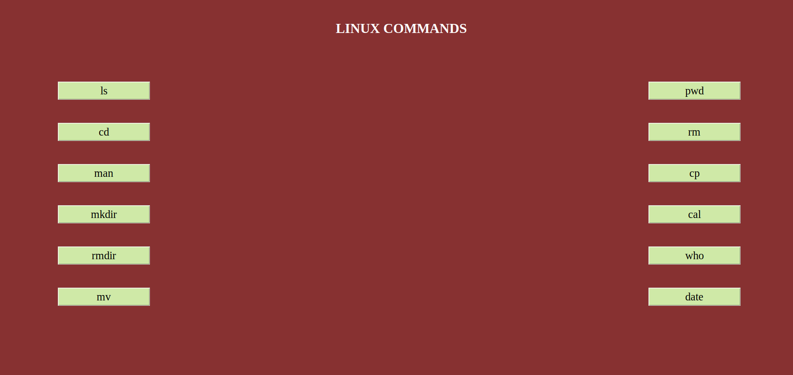
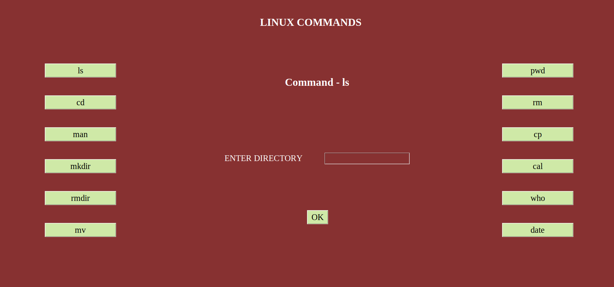
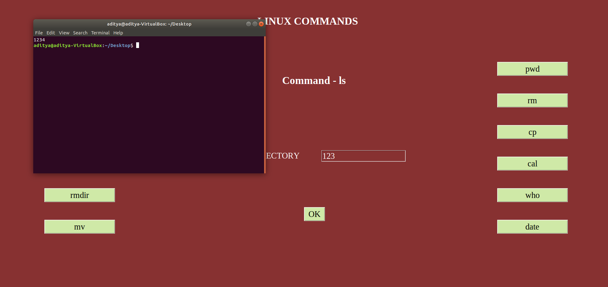
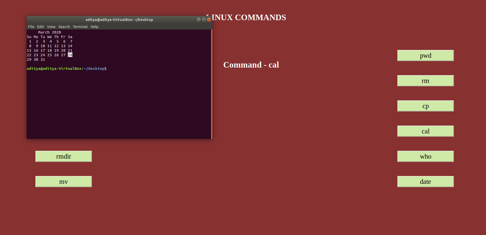

# Basic-Linux-Commands-GUI
A GUI for running the basic linux commands without having to write it on the command prompt made using Python Tkinter Library

WORKS ONLY ON LINUX

How to Execute -
Execute the 'linuxcomm.py' python file

<h4>Screenshots - </h4>

  
   
